# f-GAN-pytorch
 A pytorch implementation of "f-GAN: Training Generative Neural Samplers using Variational Divergence Minimization"

## Result

 - 1 epochs
 
    Kullback-Leibler                                | Reverse-KL                                    | Pearson-X2
    :---:                                           | :---:                                         | :---:
    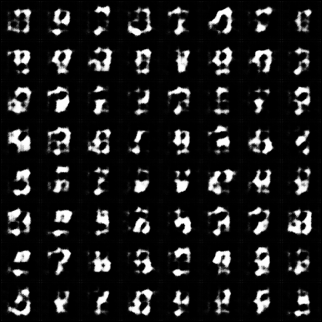			       | 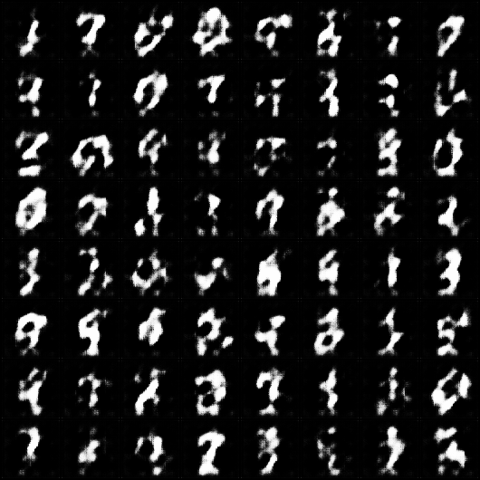   	    | 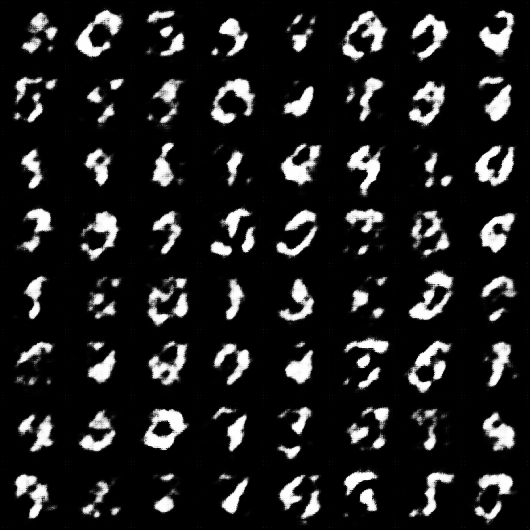
    **Squared-Hellinger**                           | **Jensen-Shannon**                            | **GAN**
    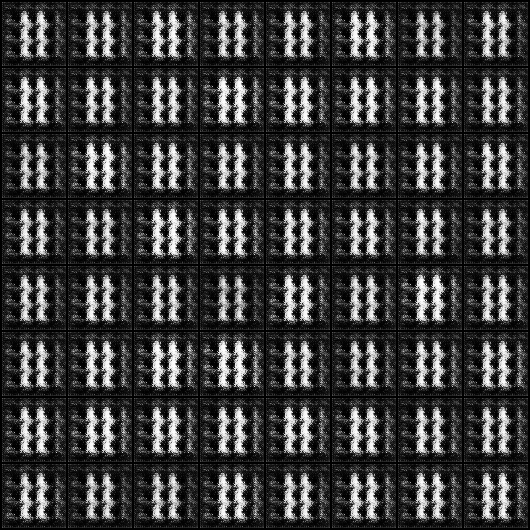			       | 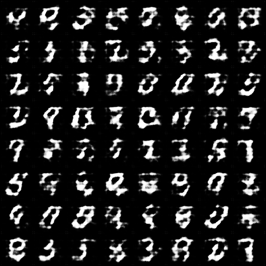 		     | 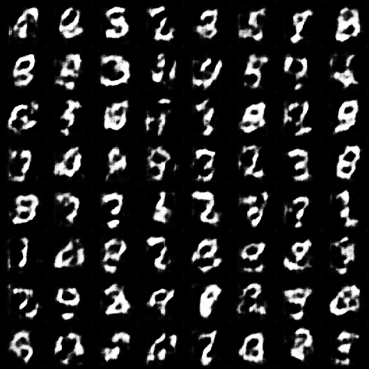
	
	
	
  - 20 epochs
  
      Kullback-Leibler                                  | Reverse-KL                                    | Pearson-X2
    :---:                                           | :---:                                         | :---:
    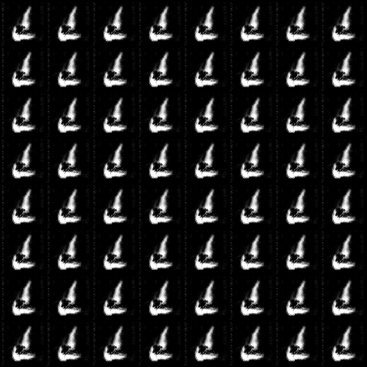			       | 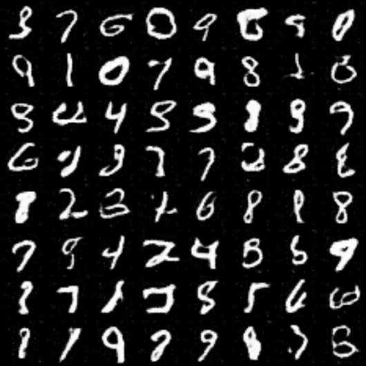   	    | 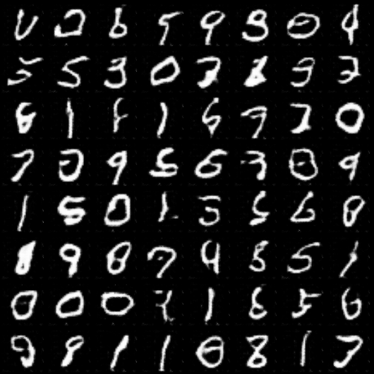
    **Squared-Hellinger**                           | **Jensen-Shannon**                            | **GAN**
    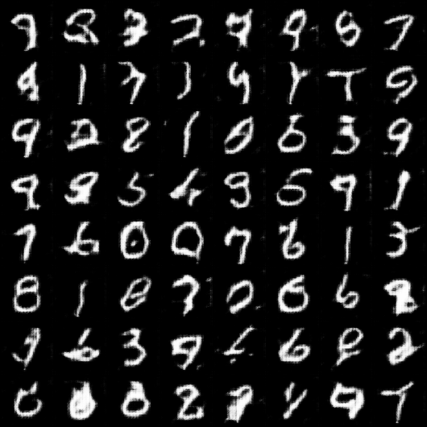			       | 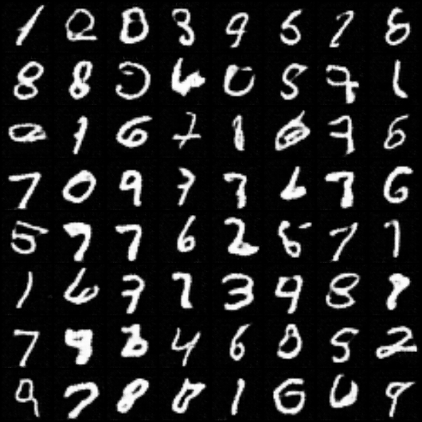 		     | 
	
	
	Mode collapse occurs after 7 epochs for Kullback-Leibler divergence objective
	
	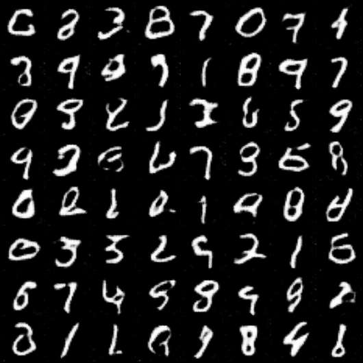
	
	This is the result of 7 epochs of Kullback-Leibler divergence objective.

